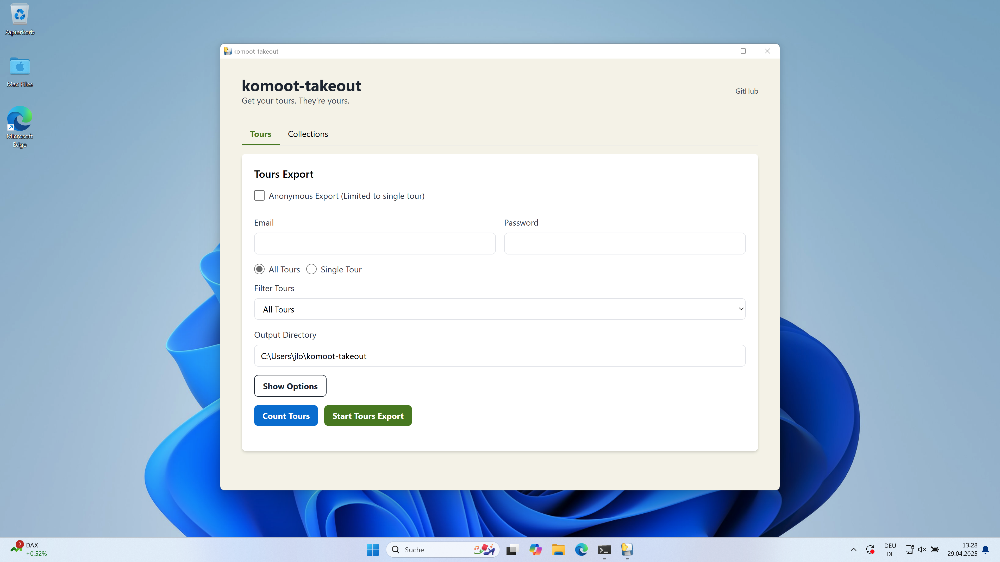

# 🧭 komoot-takeout
**Reclaim your Tours and Collections from komoot in one click with this simple desktop app.**

Building on [komootGPX](https://github.com/timschneeb/KomootGPX/), **komoot-takeout** lets you backup all your Tours including Highlights and personal photos, as well as all public **komoot Collections**.  

Consider this tool a stop-gap solution created in response to Komoot locking up our user data. It's not a replacement for the platform providing native one-click export. Be aware that Komoot may lock down their API at any time, breaking this tool. **Backup your data now.** 

## 🔍 Key Features

- **One-click Tour downloads**: Returns your GPX files with Highlights as points of interest and any personal photos
- **Batch download**: Download all of your Activities and Routes at once
- **Custom download folder**: Choose where to save your GPX files. 
- **Native desktop experience**: Runs as a standalone desktop application
- **Download public Komoot Collections**: Backup all tracks in a Collection

## 🖥 Supported Platforms

- **Windows (.exe):** ⬇️ [komoot-takeout.exe ](https://github.com/nevvkid/komoot-takeout/raw/1fb58e052c5b06e9c6c1fac2a3e370ed183ce96e/dist/komoot-takeout.exe)⬇️
- **macOS (.app):** ⬇️ [komoot-takeout.app(macOS).zip](https://github.com/nevvkid/komoot-takeout/raw/b33521fb8c5da4472e847c451b918125ac5d8a2b/dist/komoot-takeout.app(macOS).zip)⬇️

Only tested with Windows 11 Pro & macOS 15.x.x (Apple silicon)
---

---

## ℹ️ About This Project

This project builds on the excellent [komootGPX](https://github.com/timschneeb/KomootGPX/) library by [timschneeb](https://github.com/timschneeb), which provides the core functionality for downloading GPX tracks from Komoot. The desktop app provides a user-friendly interface for downloading your Komoot files without needing to use the command line. As it was coded in a weekend with generative AI, you may encounter errors and bugs.

- [PyWebView](https://pywebview.flowrl.com/) for the desktop window framework
- [Flask](https://flask.palletsprojects.com/) for the web framework
- [Beautiful Soup](https://www.crummy.com/software/BeautifulSoup/) for HTML parsing
- [PyInstaller](https://www.pyinstaller.org/) for executable packaging

## 🚀 Contributing
This tool contains bugs due to being rapidly coded with the help of generative AI. Contributions are welcome. Please open an issue or a pull request. 

### Known issues

- Single Tour downloads (with login) result in an error. Recommended workaround: Download GPX file directly from Komoot. 
- On some Windows systems, you may see a Rectangle.op_Equality error in the logs. This is a known issue with PyWebView and doesn't affect functionality.
- If you have a firewall or antivirus, it might block the app from accessing the internet. Make sure to allow the app through your firewall.

### Log Files
The application creates a log file called `komoot_exporter.log` in the directory where you run the executable. This file contains detailed information if something goes wrong.

## ⚠ Disclaimer

This project is a personal, non-commercial hobby project and is not affiliated with, endorsed by, or associated with Komoot GmbH in any way.

Use this application at your own risk. The developers take no responsibility for any data loss, account issues, or other problems that may arise from using this software.

All trademarks, logos, and brand names are the property of their respective owners.

## 📃 License

This project is licensed under the GNU General Public License v3.0 (GPL-3.0) to comply with the license of the komootGPX library it uses.  
See [LICENSE](LICENSE) for more information.
